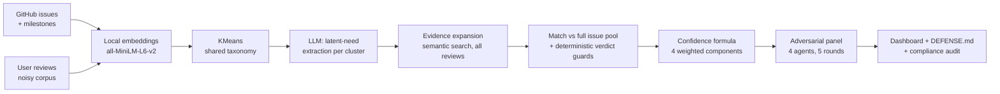

# 🕵️ The Silent Stakeholder

> Every product has a stakeholder who never files a ticket, never joins sprint planning,
> never gets a seat in the room: the user whose real need quietly diverges from what the
> team is building.

**The Silent Stakeholder** is an AI system that reads **both sides of a product** — the
team's GitHub roadmap (issues + milestones) and the large, noisy corpus of user reviews —
and surfaces the **top 3–5 latent unmet needs** the roadmap is missing or under-serving.

It is **not a complaint summarizer**. Anyone can list what users complained about.
The system infers the needs users *didn't say out loud* — second-order patterns like
workarounds, comparisons and contradictions — and then **proves every claim from data**:
a calibrated confidence score, an evidence trace of real review IDs, a verdict on what the
roadmap did wrong, and a measured response latency.

---

## ✨ What makes it different

| | |
|---|---|
| 🧠 **Latent needs, not complaints** | An LLM mines each functional cluster for second-order signals; surface complaints are rejected by design |
| 📐 **Formula-based confidence** | Scores come from a 4-component weighted formula over the data — never from an LLM's opinion |
| 🔗 **Every claim is traceable** | Each need links to up to 15 real review IDs and to the exact GitHub issue considered — no evidence, no gap |
| ⚖️ **Deterministic verdict guards** | Ticket state and match strength are facts, so code overrides the LLM when it strays |
| ⏱️ **Response latency** | For every need: how long the roadmap took to answer it — or that it never did |
| 🥊 **Adversarial audit** | A 4-agent panel (User Advocate, Roadmap Owner, Evidence Auditor, Judge) attacks the results before any judge can |
| 🔄 **Product-agnostic** | Point it at any app with reviews + a public issue tracker; nothing is hardcoded to one product |
| ✅ **Self-verifying** | `compliance_check.py` re-proves all 18 brief requirements straight from the database, in seconds |

---

## 🚀 Quick start

```bash
pip install -r requirements.txt
cp .env.example .env          # add OPENAI_API_KEY (and optionally GITHUB_TOKEN)
streamlit run app.py          # open the dashboard
```

The stored analysis loads instantly. To analyse from scratch, pick a product in the
sidebar and press **Re-run analysis** — every stage reports progress as it runs.

```bash
python compliance_check.py    # 18-point audit of the current results (free, no LLM)
python run_debate.py          # adversarial panel over the current results
python make_defense_sheet.py  # regenerate DEFENSE.md talking points from the live DB
python discover_projects.py   # find & rank products that qualify for analysis
```

**Costs:** embeddings are local (`sentence-transformers`) and free; the LLM steps use
`gpt-4o-mini` — a full analysis run costs about **$0.02**.

---

## 🏗️ How it works



### The pipeline, step by step

1. **Embed** — issues and reviews are embedded locally (`all-MiniLM-L6-v2`): free,
   no quota, reproducible.
2. **Cluster** — KMeans builds *one shared functional taxonomy* across both corpora, so
   the roadmap and the user signals speak the same language.
3. **Extract** — per cluster, an LLM mines **latent needs**: it must justify each one with
   second-order signals (workarounds, comparisons, contradictions across reviews) and is
   explicitly forbidden from echoing single complaints.
4. **Expand evidence** — a semantic search across **all** reviews (cosine ≥ 0.4, capped
   at 15) grounds each need in the full corpus, not just the LLM's sample.
5. **Match & verdict** — each need is matched against the **full issue pool**, then
   classified. Deterministic guards enforce the rules below — the LLM cannot override facts.
6. **Score** — confidence comes from a formula, not a feeling (see below).
7. **Measure latency** — for every need: when users last voiced it vs when (whether) the
   roadmap opened a ticket for it.
8. **Audit** — the adversarial panel argues over a Python-computed facts block and issues
   a per-need ruling: UPHELD / CONTESTED / OVERTURNED.

### Verdict rules (enforced in code, not by the LLM)

| Evidence about the roadmap | Verdict |
|---|---|
| No issue above cosine 0.40 | **IGNORED** — never even framed |
| Match 0.40–0.55 (topical adjacency only) | **MISUNDERSTOOD** — coverage cannot be claimed at this strength |
| Open, stale, no milestone | **UNDER-PRIORITIZED** |
| Closed as `not_planned` | **UNDER-PRIORITIZED** — seen and declined |
| Closed as `completed`, strong match, right framing | **COVERED** — excluded from the ranking, kept for audit |
| Closed as `completed`, but framed around a different problem | **MISUNDERSTOOD** — the need survives the fix |

### Confidence formula

```
confidence = 0.35 · evidence_volume        (log of supporting reviews)
           + 0.15 · rating_spread          (diversity of star ratings)
           + 0.25 · consistency            (semantic similarity across evidence)
           + 0.25 · effective_gap_certainty
where effective_gap_certainty = verdict_weight · (0.4 + 0.6 · consistency)
```

The dampening term exists because a harsh verdict must never mask weak, inconsistent
evidence — a bug the adversarial panel itself caught, which is why the term is there.
All components are stored per need, so any score can be decomposed live.

### Response latency

For each unmet need the system computes the window when users voiced it (from review
dates) against what the roadmap did (`created_at` / `closed_at` / `state_reason` of the
matched issue). The result is a single honest number per need — *"answered after 8 months"*,
*"took 3 more years to close"*, or *"**never** — no ticket ever framed this"* — shown on
every gap card and fed to the chat and the panel.

---

## 🥊 The adversarial agent panel

The pipeline's results are never taken at face value. Before any human judge sees them,
**four AI agents analyse the results together** — each from a deliberately conflicting
point of view, so weaknesses surface in argument rather than in the live defense:

| Agent | Role in the analysis |
|---|---|
| 🙋 **User Advocate** | Speaks for the reviewers who will never be in the room. Checks each stated need against the lived experience in the reviews — and attacks needs phrased in product-speak or flattened into complaint summaries |
| 🗺️ **Roadmap Owner** | Defends the product team. For every gap, argues whether the roadmap is really failing users or the analysis simply matched the wrong issue — challenging each IGNORED / UNDER-PRIORITIZED / MISUNDERSTOOD verdict |
| 🔍 **Evidence Auditor** | Audits rigour, not opinions. Verifies the evidence genuinely supports each need (not just topically-similar noise), and that confidence components match the evidence — citing specific review IDs when objecting |
| ⚖️ **Judge** | Runs the debate and issues rulings. Accepts no assertion without an evidence trace |

They debate over **five structured rounds** — opening statements → cross-examination →
the Judge's interrogation → rebuttals → final ruling. Crucially, the panel argues over a
**Python-computed facts block** (real review IDs, issue states, cosine similarities,
latencies) rather than over each other's claims, so the debate stays grounded in data.

The Judge's output is a **per-need ruling** — `UPHELD` / `CONTESTED` / `OVERTURNED` —
plus a headline verdict, the list of disputes, and the questions the team *must* be ready
for in the live defense. Everything lands in `debate_<slug>.json` and is rendered in the
dashboard: ruling pills on each gap card, and the full round-by-round transcript in
Analyst mode.

This panel has already earned its keep: it caught a real bug in the confidence formula
(a harsh verdict masking weak evidence) and forced the verdict-guard redesign — both
fixes are now part of the pipeline.

---

## 🔄 Works with any product

A product is resolved once (`product.py`) and flows into the review query, the GitHub
fetch, every LLM prompt, the database name and the UI copy. Each product gets its own
`gaps_<slug>.db` and `debate_<slug>.json`, so analyses never overwrite one another.

**Three ways to switch — no code changes:**

```bash
ANALYSIS_PACKAGE=org.ppsspp.ppsspp streamlit run app.py             # from the catalogue
GITHUB_REPO=owner/repo PRODUCT_NAME="My App" streamlit run app.py   # manual override
```

…or just pick one from the **Product** dropdown in the sidebar and press *Re-run analysis*.

**Finding qualifying products:** `discover_projects.py` scans the review corpora, maps
package names to GitHub repos, verifies each repo against the live API (existence, issue
count, milestones, not archived) and scores both sides. The current catalogue holds
**20+ verified products** — PPSSPP, WordPress for Android, Thunderbird/K-9, AnkiDroid,
AntennaPod, Bluesky and more — several of them fully analysed and switchable from the
dropdown. Orbot (Tor for Android) serves as the default demonstration case.

**Data sources** are a pluggable registry (`sources.py`): each adapter declares its key
field and whether it can tie a signal to one concrete product — the binding requirement
for "same product, both sides". Adding a dataset means writing one `fetch` function.

---

## 📊 The dashboard

- **Gap cards** — rank, the need in the user's words, verdict pill, confidence bar,
  latency strip, and two expanders: the full evidence trace (clickable review IDs) and
  the score breakdown by component.
- **Grounded chat** — ask anything about the results; answers cite real review IDs and
  issue numbers from the database, in English or Russian.
- **Analyst mode** — the full audit trail one toggle away: all candidates with scores,
  the shared taxonomy chart, the complete panel transcript, raw issue/review tables.
- **Bilingual** — every label ships in English and Russian with parity-checked keys.

---

## ✅ Verifiability

- **`python compliance_check.py`** — re-proves the brief end-to-end from the DB:
  every evidence ID exists, every issue number is real, the ranking is strictly
  monotonic, verdict guards hold on every candidate, every cluster was mined
  (the prepared answer to *"here's a gap you missed"*). **18/18 checks.**
- **Every number is recomputed from the database on render** — nothing in the UI is
  hardcoded.
- **`DEFENSE.md`** — a generated live-defense sheet: per-need talking points, score
  decompositions, and answers to the hard questions, all derived from the current DB.

---

## 📁 Project structure

| File | Role |
|------|------|
| `gap_analyzer.py` | Core pipeline: embed → cluster → extract → expand → match → score |
| `timeline.py` | Response-latency computation |
| `product.py` | Single source of truth for which product is analysed |
| `sources.py` | Pluggable registry of review/ticket datasets |
| `discover_projects.py` | Finds & ranks products that have both sides |
| `github_client.py` | Roadmap fetch (issues, milestones, `state_reason`) |
| `database.py` | SQLite persistence, one file per product |
| `debate_orchestrator.py` / `run_debate.py` | 4-agent adversarial panel |
| `compliance_check.py` | Automated 18-point brief-compliance audit |
| `make_defense_sheet.py` | Generates `DEFENSE.md` from the live DB |
| `project_chat.py` | Grounded Q&A citing review IDs / issue numbers |
| `app.py` / `i18n.py` | Streamlit dashboard, bilingual EN/RU |
| `expand_evidence.py` / `recompute_confidence.py` / `reverdict.py` | Retrofit tools: re-derive evidence, scores or verdicts without a full re-run |

---

## 🧰 Tech stack

**Python** · Streamlit · sentence-transformers (local embeddings) · scikit-learn (KMeans)
· OpenAI `gpt-4o-mini` (extraction, verdicts, panel) · SQLite · DuckDB (dataset ingestion)
· Plotly

